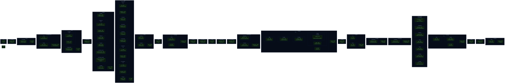

# Screen–Component Mapping

```mermaid
%%{init:{'theme':'base','themeVariables':{'background':'#060810','primaryColor':'#0c1a30','primaryTextColor':'#7dd3fc','primaryBorderColor':'#0e3a6e','edgeLabelBackground':'#0c1a30','lineColor':'#334155','secondaryColor':'#0f172a','clusterBkg':'#060c18','clusterBorder':'#1e3a5f','fontFamily':'JetBrains Mono','fontSize':'14'},'flowchart':{'nodeSpacing':40,'rankSpacing':24,'padding':8}}}%%
graph LR
  classDef ssr fill:#0d1a0d,stroke:#16a34a,color:#86efac
  classDef csr fill:#2d1200,stroke:#c2410c,color:#fb923c
  classDef ssg fill:#1a0d1a,stroke:#7c3aed,color:#c4b5fd
  classDef isr fill:#1a1a0d,stroke:#ca8a04,color:#fde047
  classDef ppr fill:#0d1a2d,stroke:#2563eb,color:#93c5fd
  classDef unk fill:#1a1a1a,stroke:#6b7280,color:#9ca3af
  classDef pkg fill:#0c1018,stroke:#475569,color:#cbd5e1
  classDef muted fill:#0a0d14,stroke:#374151,color:#64748b,stroke-dasharray: 3 3
  classDef hdr fill:#06080f,stroke:#1e3a5f,color:#7dd3fc
  subgraph AI_T["📄 /ai"]
    route_app_pages_ai_index_vue["ai · SSR<br/>🔗 /ai"]:::ssr
  end
  subgraph CALENDAR_T["📄 /calendar"]
    route_app_pages_calendar_vue["calendar · SSR<br/>🔗 /calendar"]:::ssr
  end
  subgraph CHAT_T["📄 /chat"]
    route_app_pages_chat_index_vue["chat · SSR<br/>🔗 /chat"]:::ssr
    subgraph CHAT__CHANNELID_T["📄 /:channelId"]
      route_app_pages_chat__channelId__vue[":channelId · SSR<br/>🔗 /chat/:channelId"]:::ssr
    end
  end
  subgraph CORRESPONDENCE_T["📄 /correspondence"]
    route_app_pages_correspondence_index_vue["correspondence · SSR<br/>🔗 /correspondence"]:::ssr
    subgraph CORRESPONDENCE__ID_T["📄 /:id"]
      route_app_pages_correspondence__id__vue[":id · SSR<br/>🔗 /correspondence/:id"]:::ssr
    end
    subgraph CORRESPONDENCE_INBOX_T["📄 /inbox"]
      route_app_pages_correspondence_inbox_vue["inbox · SSR<br/>🔗 /correspondence/inbox"]:::ssr
    end
  end
  CORRESPONDENCE__ID_T ~~~ CORRESPONDENCE_INBOX_T
  subgraph CRM_T["📄 /crm"]
    route_app_pages_crm_index_vue["crm · SSR<br/>🔗 /crm"]:::ssr
    subgraph CRM_CONTACTS_T["📄 /contacts"]
      route_app_pages_crm_contacts_index_vue["contacts · SSR<br/>🔗 /crm/contacts"]:::ssr
      subgraph CRM_CONTACTS__ID_T["📄 /:id"]
        route_app_pages_crm_contacts__id__vue[":id · SSR<br/>🔗 /crm/contacts/:id"]:::ssr
      end
    end
    subgraph CRM_OPPORTUNITIES_T["📄 /opportunities"]
      route_app_pages_crm_opportunities_index_vue["opportunities · SSR<br/>🔗 /crm/opportunities"]:::ssr
    end
  end
  CRM_CONTACTS_T ~~~ CRM_OPPORTUNITIES_T
  subgraph DASHBOARD_T["📄 /dashboard"]
    route_app_pages_dashboard_vue["dashboard · SSR<br/>🔗 /dashboard"]:::ssr
  end
  subgraph FINANCE_T["📄 /finance"]
    route_app_pages_finance_index_vue["finance · SSR<br/>🔗 /finance"]:::ssr
    subgraph FINANCE_BUDGETS_T["📄 /budgets"]
      route_app_pages_finance_budgets_index_vue["budgets · SSR<br/>🔗 /finance/budgets"]:::ssr
    end
    subgraph FINANCE_EXPENSES_T["📄 /expenses"]
      route_app_pages_finance_expenses_index_vue["expenses · SSR<br/>🔗 /finance/expenses"]:::ssr
      subgraph FINANCE_EXPENSES_MY_T["📄 /my"]
        route_app_pages_finance_expenses_my_vue["my · SSR<br/>🔗 /finance/expenses/my"]:::ssr
      end
    end
    subgraph FINANCE_INVOICES_T["📄 /invoices"]
      route_app_pages_finance_invoices_index_vue["invoices · SSR<br/>🔗 /finance/invoices"]:::ssr
    end
    subgraph FINANCE_PAYROLL_T["📄 /payroll"]
      route_app_pages_finance_payroll_index_vue["payroll · SSR<br/>🔗 /finance/payroll"]:::ssr
    end
    subgraph FINANCE_PURCHASE_ORDERS_T["📄 /purchase-orders"]
      route_app_pages_finance_purchase_orders_index_vue["purchase-orders · SSR<br/>🔗 /finance/purchase-orders"]:::ssr
    end
    subgraph FINANCE_PURCHASE_REQUESTS_T["📄 /purchase-requests"]
      route_app_pages_finance_purchase_requests_index_vue["purchase-requests · SSR<br/>🔗 /finance/purchase-requests"]:::ssr
    end
    subgraph FINANCE_VENDORS_T["📄 /vendors"]
      route_app_pages_finance_vendors_index_vue["vendors · SSR<br/>🔗 /finance/vendors"]:::ssr
    end
  end
  FINANCE_BUDGETS_T ~~~ FINANCE_EXPENSES_T ~~~ FINANCE_INVOICES_T ~~~ FINANCE_PAYROLL_T ~~~ FINANCE_PURCHASE_ORDERS_T ~~~ FINANCE_PURCHASE_REQUESTS_T ~~~ FINANCE_VENDORS_T
  subgraph HR_T["📄 /hr"]
    route_app_pages_hr_index_vue["hr · SSR<br/>🔗 /hr"]:::ssr
    subgraph HR_ATTENDANCE_T["📄 /attendance"]
      route_app_pages_hr_attendance_index_vue["attendance · SSR<br/>🔗 /hr/attendance"]:::ssr
      subgraph HR_ATTENDANCE_MY_T["📄 /my"]
        route_app_pages_hr_attendance_my_vue["my · SSR<br/>🔗 /hr/attendance/my"]:::ssr
      end
    end
    subgraph HR_CONTRACTS_T["📄 /contracts"]
      route_app_pages_hr_contracts_index_vue["contracts · SSR<br/>🔗 /hr/contracts"]:::ssr
    end
    subgraph HR_DOCUMENTS_T["📄 /documents"]
      route_app_pages_hr_documents_index_vue["documents · SSR<br/>🔗 /hr/documents"]:::ssr
    end
    subgraph HR_MISSIONS_T["📄 /missions"]
      route_app_pages_hr_missions_index_vue["missions · SSR<br/>🔗 /hr/missions"]:::ssr
    end
    subgraph HR_ONBOARDING_T["📄 /onboarding"]
      route_app_pages_hr_onboarding_index_vue["onboarding · SSR<br/>🔗 /hr/onboarding"]:::ssr
    end
    subgraph HR_PERSONNEL_T["📄 /personnel"]
      route_app_pages_hr_personnel_index_vue["personnel · SSR<br/>🔗 /hr/personnel"]:::ssr
      subgraph HR_PERSONNEL__ID_T["📄 /:id"]
        route_app_pages_hr_personnel__id__vue[":id · SSR<br/>🔗 /hr/personnel/:id"]:::ssr
      end
    end
    subgraph HR_RECRUITMENT_T["📄 /recruitment"]
      route_app_pages_hr_recruitment_index_vue["recruitment · SSR<br/>🔗 /hr/recruitment"]:::ssr
      subgraph HR_RECRUITMENT__ID_T["📄 /:id"]
        route_app_pages_hr_recruitment__id__vue[":id · SSR<br/>🔗 /hr/recruitment/:id"]:::ssr
      end
    end
    subgraph HR_SETTINGS_T["📄 /settings"]
      route_app_pages_hr_settings_vue["settings · SSR<br/>🔗 /hr/settings"]:::ssr
    end
  end
  HR_ATTENDANCE_T ~~~ HR_CONTRACTS_T ~~~ HR_DOCUMENTS_T ~~~ HR_MISSIONS_T ~~~ HR_ONBOARDING_T ~~~ HR_PERSONNEL_T ~~~ HR_RECRUITMENT_T ~~~ HR_SETTINGS_T
  route_app_pages_index_vue["/ · SSR<br/>🔗 /"]:::ssr
  subgraph LEAVE_T["📄 /leave"]
    route_app_pages_leave_vue["leave · SSR<br/>🔗 /leave"]:::ssr
    subgraph LEAVE_POLICIES_T["📄 /policies"]
      route_app_pages_leave_policies_vue["policies · SSR<br/>🔗 /leave/policies"]:::ssr
    end
    subgraph LEAVE_REQUESTS_T["📄 /requests"]
      route_app_pages_leave_requests_vue["requests · SSR<br/>🔗 /leave/requests"]:::ssr
    end
  end
  LEAVE_POLICIES_T ~~~ LEAVE_REQUESTS_T
  subgraph LOGIN_T["📄 /login"]
    route_app_pages_login_vue["login · SSR<br/>🔗 /login"]:::ssr
  end
  subgraph MEETINGS_T["📄 /meetings"]
    route_app_pages_meetings_index_vue["meetings · SSR<br/>🔗 /meetings"]:::ssr
    subgraph MEETINGS__ID_T["📄 /:id"]
      route_app_pages_meetings__id__index_vue[":id · SSR<br/>🔗 /meetings/:id"]:::ssr
      subgraph MEETINGS__ID_ROOM_T["📄 /room"]
        route_app_pages_meetings__id__room_vue["room · SSR<br/>🔗 /meetings/:id/room"]:::ssr
      end
    end
  end
  subgraph MEMBERS_T["📄 /members"]
    route_app_pages_members_vue["members · SSR<br/>🔗 /members"]:::ssr
  end
  subgraph MY_FINANCE_T["📄 /my-finance"]
    route_app_pages_my_finance_index_vue["my-finance · SSR<br/>🔗 /my-finance"]:::ssr
  end
  subgraph NOTES_T["📄 /notes"]
    route_app_pages_notes_index_vue["notes · SSR<br/>🔗 /notes"]:::ssr
  end
  subgraph NOTIFICATIONS_T["📄 /notifications"]
    route_app_pages_notifications_vue["notifications · SSR<br/>🔗 /notifications"]:::ssr
  end
  subgraph ONBOARDING_T["📄 /onboarding"]
    route_app_pages_onboarding_vue["onboarding · SSR<br/>🔗 /onboarding"]:::ssr
  end
  subgraph PERFORMANCE_T["📄 /performance"]
    route_app_pages_performance_index_vue["performance · SSR<br/>🔗 /performance"]:::ssr
    subgraph PERFORMANCE_OBJECTIVES_T["📄 /objectives"]
      route_app_pages_performance_objectives_index_vue["objectives · SSR<br/>🔗 /performance/objectives"]:::ssr
    end
    subgraph PERFORMANCE_REVIEWS_T["📄 /reviews"]
      route_app_pages_performance_reviews_index_vue["reviews · SSR<br/>🔗 /performance/reviews"]:::ssr
    end
  end
  PERFORMANCE_OBJECTIVES_T ~~~ PERFORMANCE_REVIEWS_T
  subgraph PROJECTS_T["📁 /projects"]
    route_app_pages_projects_index_vue["projects · SSR<br/>🔗 /projects"]:::ssr
    subgraph PROJECTS__ID_T["📄 /:id"]
      route_app_pages_projects__id__vue[":id · SSR<br/>🔗 /projects/:id"]:::ssr
      subgraph PROJECTS__ID_FILES_T["📄 /files"]
        route_app_pages_projects__id__files_vue["files · SSR<br/>🔗 /projects/:id/files"]:::ssr
      end
      subgraph PROJECTS__ID_REPORTS_T["📄 /reports"]
        route_app_pages_projects__id__reports_vue["reports · SSR<br/>🔗 /projects/:id/reports"]:::ssr
      end
      subgraph PROJECTS__ID_SETTINGS_T["📄 /settings"]
        route_app_pages_projects__id__settings_vue["settings · SSR<br/>🔗 /projects/:id/settings"]:::ssr
      end
      subgraph PROJECTS__ID_SPRINTS_T["📄 /sprints"]
        route_app_pages_projects__id__sprints_vue["sprints · SSR<br/>🔗 /projects/:id/sprints"]:::ssr
        subgraph PROJECTS__ID_SPRINTS__SPRINTID_T["📄 /:sprintId"]
          route_app_pages_projects__id__sprints__sprintId__vue[":sprintId · SSR<br/>🔗 /projects/:id/sprints/:sprintId"]:::ssr
        end
      end
    end
    PROJECTS__ID_FILES_T ~~~ PROJECTS__ID_REPORTS_T ~~~ PROJECTS__ID_SETTINGS_T ~~~ PROJECTS__ID_SPRINTS_T
  end
  subgraph REGISTER_T["📄 /register"]
    route_app_pages_register_vue["register · SSR<br/>🔗 /register"]:::ssr
  end
  subgraph REPORTS_T["📄 /reports"]
    route_app_pages_reports_index_vue["reports · SSR<br/>🔗 /reports"]:::ssr
    subgraph REPORTS__ID_T["📄 /:id"]
      route_app_pages_reports__id__vue[":id · SSR<br/>🔗 /reports/:id"]:::ssr
    end
    subgraph REPORTS_NEW_T["📄 /new"]
      route_app_pages_reports_new_vue["new · SSR<br/>🔗 /reports/new"]:::ssr
    end
  end
  REPORTS__ID_T ~~~ REPORTS_NEW_T
  subgraph SETTINGS_T["📄 /settings"]
    route_app_pages_settings_vue["settings · SSR<br/>🔗 /settings"]:::ssr
    subgraph SETTINGS_NOTIFICATIONS_T["📄 /notifications"]
      route_app_pages_settings_notifications_vue["notifications · SSR<br/>🔗 /settings/notifications"]:::ssr
    end
  end
  subgraph SUBSCRIPTION_T["📄 /subscription"]
    route_app_pages_subscription_index_vue["subscription · SSR<br/>🔗 /subscription"]:::ssr
    subgraph SUBSCRIPTION_CHECKOUT_T["📄 /checkout"]
      route_app_pages_subscription_checkout_vue["checkout · SSR<br/>🔗 /subscription/checkout"]:::ssr
    end
  end
  subgraph SUPER_ADMIN_T["📄 /super-admin"]
    subgraph SUPER_ADMIN_CONSULTATIONS_T["📄 /consultations"]
      route_app_pages_super_admin_consultations_index_vue["consultations · SSR<br/>🔗 /super-admin/consultations"]:::ssr
    end
    subgraph SUPER_ADMIN_DASHBOARD_T["📄 /dashboard"]
      route_app_pages_super_admin_dashboard_vue["dashboard · SSR<br/>🔗 /super-admin/dashboard"]:::ssr
    end
    subgraph SUPER_ADMIN_FINANCIAL_T["📄 /financial"]
      route_app_pages_super_admin_financial_index_vue["financial · SSR<br/>🔗 /super-admin/financial"]:::ssr
    end
    subgraph SUPER_ADMIN_LOGIN_T["📄 /login"]
      route_app_pages_super_admin_login_vue["login · SSR<br/>🔗 /super-admin/login"]:::ssr
    end
    subgraph SUPER_ADMIN_PLANS_T["📄 /plans"]
      route_app_pages_super_admin_plans_index_vue["plans · SSR<br/>🔗 /super-admin/plans"]:::ssr
    end
    subgraph SUPER_ADMIN_SETTINGS_T["📄 /settings"]
      route_app_pages_super_admin_settings_index_vue["settings · SSR<br/>🔗 /super-admin/settings"]:::ssr
    end
    subgraph SUPER_ADMIN_TENANTS_T["📄 /tenants"]
      route_app_pages_super_admin_tenants_index_vue["tenants · SSR<br/>🔗 /super-admin/tenants"]:::ssr
    end
  end
  SUPER_ADMIN_CONSULTATIONS_T ~~~ SUPER_ADMIN_DASHBOARD_T ~~~ SUPER_ADMIN_FINANCIAL_T ~~~ SUPER_ADMIN_LOGIN_T ~~~ SUPER_ADMIN_PLANS_T ~~~ SUPER_ADMIN_SETTINGS_T ~~~ SUPER_ADMIN_TENANTS_T
  subgraph SURVEYS_T["📄 /surveys"]
    route_app_pages_surveys_index_vue["surveys · SSR<br/>🔗 /surveys"]:::ssr
    subgraph SURVEYS__ID_T["📄 /:id"]
      route_app_pages_surveys__id__index_vue[":id · SSR<br/>🔗 /surveys/:id"]:::ssr
      subgraph SURVEYS__ID_EDIT_T["📄 /edit"]
        route_app_pages_surveys__id__edit_vue["edit · SSR<br/>🔗 /surveys/:id/edit"]:::ssr
      end
      subgraph SURVEYS__ID_REPORT_T["📄 /report"]
        route_app_pages_surveys__id__report_vue["report · SSR<br/>🔗 /surveys/:id/report"]:::ssr
      end
    end
    SURVEYS__ID_EDIT_T ~~~ SURVEYS__ID_REPORT_T
  end
  subgraph TEAMS_T["📄 /teams"]
    route_app_pages_teams_vue["teams · SSR<br/>🔗 /teams"]:::ssr
  end
  subgraph VERIFY_OTP_T["📄 /verify-otp"]
    route_app_pages_verify_otp_vue["verify-otp · SSR<br/>🔗 /verify-otp"]:::ssr
  end
  subgraph WORKLOG_T["📄 /worklog"]
    route_app_pages_worklog_index_vue["worklog · SSR<br/>🔗 /worklog"]:::ssr
    subgraph WORKLOG_TEAM_T["📄 /team"]
      route_app_pages_worklog_team_vue["team · SSR<br/>🔗 /worklog/team"]:::ssr
    end
  end
  AI_T ~~~ CALENDAR_T ~~~ CHAT_T ~~~ CORRESPONDENCE_T ~~~ CRM_T ~~~ DASHBOARD_T ~~~ FINANCE_T ~~~ HR_T ~~~ LEAVE_T ~~~ LOGIN_T ~~~ MEETINGS_T ~~~ MEMBERS_T ~~~ MY_FINANCE_T ~~~ NOTES_T ~~~ NOTIFICATIONS_T ~~~ ONBOARDING_T ~~~ PERFORMANCE_T ~~~ PROJECTS_T ~~~ REGISTER_T ~~~ REPORTS_T ~~~ SETTINGS_T ~~~ SUBSCRIPTION_T ~~~ SUPER_ADMIN_T ~~~ SURVEYS_T ~~~ TEAMS_T ~~~ VERIFY_OTP_T ~~~ WORKLOG_T
```
